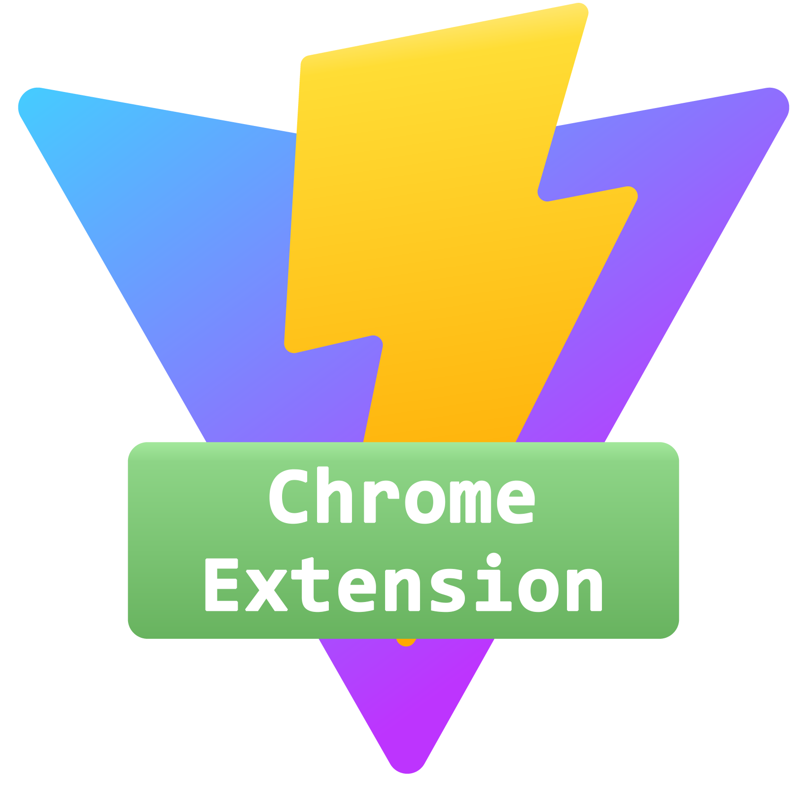

<p align="center">
    <a href="#" target="_blank" rel="noopener noreferrer">
        
    </a>
</p>
<br/>
<p align="center">
</p>
<br/>

# vite-plugin-chrome-extension

> fork from rollup-plugin-chrome-extension and evolve for `vite` and `Chrome Extension Manifest V3`

## Table of Contents

- [Installation](#installation)
- [Usage](#usage)

## Installation <a name = "installation"></a>

```shell
npm install -D vite-plugin-chrome-extension
```

## Usage <a name = "usage"></a>

In vite.config.ts, 

``` typescript
// vite.config.ts
import { resolve } from "path";
import { defineConfig } from "vite";
import { chromeExtension } from "vite-plugin-chrome-extension";

export default defineConfig({
    resolve: {
        alias: {
            "@": resolve(__dirname, "src"),
        },
    },
    build: {
        rollupOptions: {
            input: "src/manifest.json"
        }
    },
    plugins: [
        chromeExtension()
    ],
})
```

## TODO

- support sass/less in manifest.json

## How does this plugin work

See [Work flow](./docs/workflow.md)

## Examples

- [X] [Background](examples/background)

### Examples from [chrome-extensions-samples](https://github.com/GoogleChrome/chrome-extensions-samples) are test

- [X] [Hello World](examples/hello-world)
- [X] [Page Redder](examples/page-redder)
- [X] [Cookie Clearer](examples/cookie-clearer)
- [X] [Omnibox - New Tab Search](examples/new-tab-search)
- [X] [Web Accessible Resources](examples/web-accessible-resources)

### Examples with Vue

- [X] [Vue in Content Scripts](examples/vue-content-scripts)
- [X] [Vue in Full Options Page](examples/vue-full-options-page)
- [X] [Vue in Embedded Options Page](examples/vue-embedded-options-page)

### Examples with Svelte

- [X] [Svelte](examples/svelte)

## Feedback

If you have problems using this plugin, welcome to let us know.

## Known problems

## Change logs

see [CHANGELOG.md](CHANGELOG.md)
